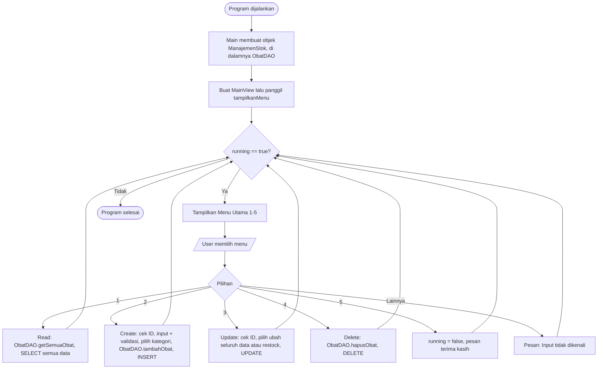
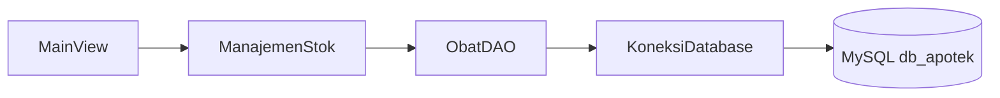

# Mini Project 4 PBO - Manajemen Stok Obat pada Apotek

Program **Sistem Manajemen Stok Obat pada Apotek** berbasis Java (CLI/console) yang dibuat untuk **Mini Project 4 – Pemrograman Berorientasi Objek (PBO)**. Program ini merupakan lanjutan dari Mini Project 3. Perubahan utamanya: data obat **tidak lagi disimpan di `ArrayList`**, melainkan di **database MySQL** yang dihubungkan memakai **JDBC (Prepared Statement)** dengan pola **DAO (Data Access Object)**. Data awal (dummy data) diisi lewat file **`.sql`**, bukan melalui kode.

- **Nama:** Muhammad Ihsan Kamil
- **NIM:** 2509116035
- **Praktikum:** Pemrograman Berorientasi Objek (PBO)

---

## 1. Deskripsi Singkat Program

**Sistem Manajemen Stok Obat Apotek** adalah aplikasi console untuk membantu apotek mencatat dan mengelola data obat. Program menyediakan fitur **CRUD** (Create, Read, Update, Delete) yang langsung terhubung ke database:

| Menu | Fitur | Keterangan |
|------|-------|------------|
| 1 | Tampilkan Semua Obat | **Read** – menampilkan seluruh data obat dari database dalam bentuk tabel |
| 2 | Tambah Obat Baru | **Create** – menambah obat baru (Obat Bebas / Obat Keras) ke database |
| 3 | Ubah Data Obat | **Update** – mengubah seluruh data (nama, stok, harga) **atau** hanya menambah stok (restock) berdasarkan ID |
| 4 | Hapus Obat | **Delete** – menghapus obat dari database berdasarkan ID |
| 5 | Keluar | Mengakhiri program |

Obat dibagi menjadi dua jenis:

- **Obat Bebas** → dapat dibeli tanpa resep, menyimpan informasi **efek samping**.
- **Obat Keras (Obat Resep)** → harus dengan resep dokter, menyimpan informasi **nama dokter**.

Data disimpan permanen di database **MySQL** (`db_apotek`, tabel `obat`), sehingga data **tidak hilang** ketika program ditutup. Data awal diambil dari file [`database/db_apotek.sql`](database/db_apotek.sql).

**Teknologi yang digunakan:** Java (JDK), MySQL, JDBC dengan MySQL Connector/J, dan pola DAO.

### Perubahan dari Mini Project 3

| Aspek | Mini Project 3 | Mini Project 4 |
|-------|----------------|----------------|
| Penyimpanan data | `ArrayList<Obat>` (sementara, hilang saat program ditutup) | Database **MySQL** (permanen) |
| Akses data | `ManajemenStok` mengelola list secara langsung | `ManajemenStok` meneruskan ke **`ObatDAO`** yang menjalankan SQL dengan **PreparedStatement** |
| Koneksi database | Tidak ada | Class `KoneksiDatabase` (package `config`) memakai `DriverManager` |
| Dummy data | Dimasukkan lewat kode di `Main.java` | Diisi lewat **file `.sql`** (`database/db_apotek.sql`) |
| Isi `Main.java` | Membuat controller, mengisi dummy data, menjalankan view | Hanya membuat controller dan menjalankan view |
| Pencarian ID | Dicari di `ArrayList` dengan `equalsIgnoreCase` | Query `SELECT ... WHERE id_obat = ?` (perbandingan huruf besar/kecil mengikuti collation MySQL, default-nya tidak membedakan) |
| Class baru | – | `ObatDAO`, `KoneksiDatabase`, `TesKoneksi` |
| Getter subclass | `efekSamping` dan `namaDokter` tidak punya getter | Ditambahkan `getEfekSamping()` dan `getNamaDokter()` karena dibutuhkan DAO untuk menyimpan ke database |

---

## 2. Penjelasan Struktur Package

Program dipisah ke dalam package sesuai pola **MVC (Model – View – Controller)**, ditambah package `Main` sebagai titik masuk program, `Utils` sebagai kelas bantu, dan **`config`** (baru) untuk koneksi database.

```
Minpro-4-PBO-ManajemenStokObatApotek/
├── README.md
├── database/
│   └── db_apotek.sql
└── src/
    ├── Main/
    │   └── Main.java
    ├── Model/
    │   ├── InfoObat.java
    │   ├── Obat.java
    │   ├── ObatBebas.java
    │   └── ObatResep.java
    ├── Controller/
    │   ├── ManajemenStok.java
    │   └── ObatDAO.java
    ├── View/
    │   └── MainView.java
    ├── Utils/
    │   └── ValidasiInput.java
    └── config/
        ├── KoneksiDatabase.java
        └── TesKoneksi.java
```

| Package | File | Peran |
|---------|------|-------|
| `Main` | `Main.java` | Titik masuk program: membuat controller lalu menjalankan view |
| `Model` | `InfoObat.java` | **Interface** – kontrak `tampilkanInfo()` |
| `Model` | `Obat.java` | **Abstract class / superclass** – atribut & perilaku umum semua obat, mengimplementasikan `InfoObat` |
| `Model` | `ObatBebas.java` | **Subclass** dari `Obat` – menambah atribut `efekSamping` |
| `Model` | `ObatResep.java` | **Subclass** dari `Obat` – menambah atribut `namaDokter` |
| `Controller` | `ManajemenStok.java` | Perantara antara View dan DAO; menyediakan operasi CRUD (termasuk **overloading** `updateObat()`) |
| `Controller` | `ObatDAO.java` | **(Baru)** Satu-satunya class yang menjalankan query SQL ke tabel `obat` memakai `PreparedStatement` |
| `View` | `MainView.java` | Antarmuka pengguna: menu, membaca input keyboard, menampilkan tabel dan pesan |
| `Utils` | `ValidasiInput.java` | Kelas bantu untuk validasi input angka (dipanggil oleh View) |
| `config` | `KoneksiDatabase.java` | **(Baru)** Menyediakan koneksi ke database MySQL |
| `config` | `TesKoneksi.java` | **(Baru)** Program kecil untuk mengecek koneksi database berhasil atau tidak |
| `database` | `db_apotek.sql` | **(Baru)** Skema tabel `obat` dan dummy data awal |

**Alasan pemisahan:**

- **Model** berisi data obat beserta aturan datanya (atribut, getter/setter, dan format tampilan satu baris data).
- **Controller** berisi logika pengelolaan data. `ManajemenStok` tidak berinteraksi dengan `Scanner` maupun SQL; ia hanya meneruskan perintah ke `ObatDAO`.
- **DAO (`ObatDAO`)** memisahkan seluruh kode SQL dari View dan logika program, sehingga jika database atau query berubah, hanya satu class yang perlu diubah.
- **View** mengurus tampilan menu dan pengambilan input, lalu meneruskannya ke Controller.
- **Utils** memisahkan logika validasi.
- **config** memisahkan pengaturan koneksi (URL, user, password) dari class lain.

---

## 3. Penjelasan Alur Program

### 3.1 Diagram Alur



### 3.2 Alur Data antar Lapisan



`MainView` tidak pernah menyentuh SQL. Setiap permintaan melewati `ManajemenStok` → `ObatDAO` → `KoneksiDatabase` → MySQL, lalu hasilnya kembali dengan jalur yang sama.

### 3.3 Penjelasan Alur Langkah demi Langkah

#### Program Dijalankan (Run)

1. Method `main()` di `Main/Main.java` dieksekusi.
2. Dibuat objek `ManajemenStok app` (Controller). Di dalamnya terdapat objek `ObatDAO`.
3. **Tidak ada lagi dummy data yang dimasukkan lewat kode.** Data awal (`OBT01` dan `OBT02`) sudah berada di database karena file `db_apotek.sql` diimpor sebelum program dijalankan.
4. Dibuat objek `MainView view` dengan mengirim `app` ke constructor, lalu `view.tampilkanMenu()` dipanggil.
5. Variabel `running = true` dan program masuk ke perulangan `while (running)`.

**Screenshot: Program pertama kali dijalankan**


**Screenshot: Data dummy pada database (phpMyAdmin / MySQL) setelah import `db_apotek.sql`**


---

#### Menu Utama

Setiap iterasi perulangan menampilkan:

```
=== SISTEM MANAJEMEN STOK OBAT APOTEK ===
1. Tampilkan Semua Obat (Read)
2. Tambah Obat Baru (Create)
3. Ubah Data Obat (Update)
4. Hapus Obat (Delete)
5. Keluar
Pilih menu (1-5):
```

Input dibaca dengan `scanner.nextLine().trim()` lalu diproses menggunakan `switch`. Jika input bukan `1`–`5`, masuk ke `default` dan muncul pesan **"Input tidak dikenali! Harap masukkan angka 1-5."** lalu menu ditampilkan kembali.

**Screenshot: Input menu tidak valid**


---

#### Menu 1: Tampilkan Semua Obat (Read)

1. `tampilkanTabelObat()` di `MainView` memanggil `app.getSemuaObat()`, yang diteruskan ke `ObatDAO.getSemuaObat()`.
2. DAO menjalankan `SELECT * FROM obat`, lalu membuat objek `ObatBebas` atau `ObatResep` untuk setiap baris hasil query (tergantung kolom `kategori`).
3. Jika list kosong → tampil pesan **"Stok obat masih kosong."**
4. Jika ada data → dicetak header tabel (ID, Nama Obat, Kategori, Stok, Harga, Keterangan Khusus).
5. Perulangan `for` memanggil `o.tampilkanInfo()` untuk setiap obat. Karena **polymorphism**, obat bebas menampilkan `Efek: ...` sedangkan obat resep menampilkan `Dokter: ...`.

**Screenshot: Tampilan data dari database (dummy data)**


**Screenshot: Menu 1 saat data kosong (setelah semua data dihapus)**


---

#### Menu 2: Tambah Obat Baru (Create)

Urutan input:

1. **ID Obat** (teks) → dicek lewat `app.cariObatById()` (query `SELECT ... WHERE id_obat = ?`). Jika ID sudah ada di database, muncul pesan **"ID Obat sudah terdaftar! Gunakan menu update."** dan proses dibatalkan.
2. **Nama Obat** (teks)
3. **Jumlah Stok** → divalidasi oleh `ValidasiInput.inputIntPositif()` (bilangan bulat, minimal 1)
4. **Harga Obat** → divalidasi oleh `ValidasiInput.inputDoublePositif()` (angka, minimal Rp 2.000)
5. **Kategori Obat** (dipilih dengan `switch`):
   - `1` → Obat Bebas → lanjut input **Efek Samping** → objek `ObatBebas` dibuat
   - `2` → Obat Keras → lanjut input **Nama Dokter** → objek `ObatResep` dibuat
   - Selain itu → pesan **"Kategori tidak valid! Batal menambahkan data."** dan data tidak disimpan
6. Objek dikirim ke `app.tambahObat(...)` → `ObatDAO.tambahObat()` yang menjalankan `INSERT`. Pesan berhasil hanya tampil jika `INSERT` benar-benar berhasil (nilai balik `true`); jika gagal, tampil pesan gagal.

**Screenshot: Tambah obat Bebas (Kategori 1)**


**Screenshot: Tambah obat Keras (Kategori 2)**


**Screenshot: Data baru muncul di database setelah ditambahkan**


**Screenshot: ID obat sudah terdaftar**


**Screenshot: Validasi input salah pada Stok**


**Screenshot: Validasi input salah pada Harga**


**Screenshot: Kategori tidak valid**


---

#### Menu 3: Ubah Data Obat (Update)

1. User memasukkan **ID Obat** yang ingin diubah.
2. Program mencari dengan `cariObatById()` (query `SELECT`). Jika tidak ditemukan, tampil **"Gagal Update! ID Obat tidak ditemukan."**
3. Jika ditemukan, user memilih jenis update:
   - `1` **Ubah Seluruh Data** → input Nama Baru, Stok Baru, Harga Baru → memanggil `updateObat(id, nama, stok, harga)` (**overloading versi 1**, 4 parameter) → `ObatDAO.updateObat()` menjalankan `UPDATE obat SET nama_obat = ?, stok = ?, harga = ? WHERE id_obat = ?`.
   - `2` **Tambah Stok Saja (Restock)** → input jumlah stok tambahan → memanggil `updateObat(id, tambahanStok)` (**overloading versi 2**, 2 parameter) → `ObatDAO.updateStokObat()` menjalankan `UPDATE obat SET stok = stok + ? WHERE id_obat = ?`.
   - Selain itu → pesan **"Opsi tidak valid! Batal mengubah data."**
4. Pesan berhasil hanya tampil jika `executeUpdate()` mengubah minimal satu baris; jika gagal, tampil pesan gagal.

**Screenshot: Ubah seluruh data**


**Screenshot: Restock (tambah stok)**


**Screenshot: Update dengan ID yang tidak ditemukan**


---

#### Menu 4: Hapus Obat (Delete)

1. User memasukkan **ID Obat** yang ingin dihapus.
2. `app.hapusObat(id)` → `ObatDAO.hapusObat()` menjalankan `DELETE FROM obat WHERE id_obat = ?`.
3. Jika ada baris yang terhapus tampil **"Obat berhasil dihapus!"**, jika tidak ada tampil **"Gagal Hapus! ID Obat tidak ditemukan."**

**Screenshot: Hapus obat berhasil**


**Screenshot: Hapus dengan ID tidak ditemukan**


---

#### Menu 5: Keluar

1. Variabel `running` diubah menjadi `false`.
2. Tampil pesan **"Terima kasih!"**
3. Perulangan `while` berhenti dan program selesai.

**Screenshot: Keluar dari program**


---

## 4. Penjelasan Penerapan Encapsulation dan Inheritance

### 4.1 Encapsulation (Access Modifier, Getter dan Setter)

Seluruh atribut dibuat `private` sehingga tidak bisa diakses langsung dari luar class, dan hanya bisa diakses lewat method `public`.

| Class | Atribut Private | Getter | Setter |
|-------|-----------------|--------|--------|
| `Obat` | `idObat` (`final`) | `getIdObat()` | – (ID tidak boleh diubah setelah dibuat) |
| `Obat` | `namaObat` | `getNamaObat()` | `setNamaObat()` |
| `Obat` | `stok` | `getStok()` | `setStok()` |
| `Obat` | `harga` | `getHarga()` | `setHarga()` |
| `ObatBebas` | `efekSamping` | `getEfekSamping()` **(baru)** | – |
| `ObatResep` | `namaDokter` | `getNamaDokter()` **(baru)** | – |
| `ManajemenStok` | `obatDAO` (`final`) | – | – |
| `KoneksiDatabase` | `URL`, `USER`, `PASS` (`static final`) | – | – |
| `MainView` | `app`, `scanner` (`final`) | – | – |

| Modifier | Penerapan | Contoh |
|----------|-----------|--------|
| `private` | Semua atribut | `private int stok;`, `private final ObatDAO obatDAO` |
| `private final` | Atribut yang referensinya tidak boleh diganti | `private final String idObat;`, `private final Scanner scanner;` |
| `private static final` | Konstanta konfigurasi koneksi | `private static final String URL = "jdbc:mysql://localhost:3306/db_apotek";` |
| `public` | Class, constructor, dan method yang perlu diakses class lain | `public abstract class Obat`, `public boolean hapusObat()`, getter & setter |

**Poin penting:**

- Getter `getEfekSamping()` dan `getNamaDokter()` ditambahkan agar `ObatDAO` bisa membaca nilai atribut private tersebut untuk disimpan ke kolom `keterangan_khusus`, tanpa membuat atributnya `public`.
- Detail koneksi (URL, user, password) disembunyikan di dalam `KoneksiDatabase`, dan detail SQL disembunyikan di dalam `ObatDAO`. `MainView` tidak tahu bagaimana data disimpan.
- Pada Mini Project 4, perubahan data di database dilakukan lewat perintah `UPDATE`, bukan lewat setter pada objek. Setter pada class `Obat` tetap dipertahankan sebagai bagian dari encapsulation class model.

### 4.2 Inheritance

Program memiliki **1 superclass (abstract)** dan **2 subclass**:

```
            ┌──────────────────────────┐
            │  Obat (abstract class)   │
            │  idObat, namaObat,       │
            │  stok, harga             │
            └────────────┬─────────────┘
          extends        │        extends
      ┌──────────────────┴──────────────────┐
┌─────▼───────────┐                 ┌───────▼─────────┐
│ ObatBebas       │                 │ ObatResep       │
│ + efekSamping   │                 │ + namaDokter    │
└─────────────────┘                 └─────────────────┘
```

| Class | Peran | Atribut Tambahan | Lokasi |
|-------|-------|------------------|--------|
| `Obat` | Superclass (abstract) | – | `Model/Obat.java` |
| `ObatBebas` | Subclass 1 (`extends Obat`) | `efekSamping` | `Model/ObatBebas.java` |
| `ObatResep` | Subclass 2 (`extends Obat`) | `namaDokter` | `Model/ObatResep.java` |

Kedua subclass memakai `super(...)` di constructor untuk memanggil constructor `Obat`, sehingga atribut umum (ID, nama, stok, harga) tidak perlu ditulis ulang. Subclass hanya menambahkan atribut khususnya.

---

## 5. Penjelasan Penerapan Polymorphism dan Abstraction

### 5.1 Abstraction

Abstraction diterapkan dengan **abstract class** dan **abstract method** pada class `Obat` (`Model/Obat.java`).

| Elemen | Lokasi | Penjelasan |
|--------|--------|------------|
| Abstract class | `public abstract class Obat` | Menjadi kerangka umum semua obat. Class ini **tidak bisa diinstansiasi** (`new Obat(...)` akan error), karena "obat" secara umum tidak cukup spesifik; harus berupa obat bebas atau obat keras. |
| Abstract method | `public abstract String getKategoriString();` | Hanya berisi deklarasi tanpa isi. Setiap subclass **wajib** mengimplementasikannya. |
| Implementasi `ObatBebas` | `Model/ObatBebas.java` | `getKategoriString()` mengembalikan `"Obat Bebas"` |
| Implementasi `ObatResep` | `Model/ObatResep.java` | `getKategoriString()` mengembalikan `"Obat Keras"` |

`Obat.tampilkanInfo()` memanggil `getKategoriString()` tanpa perlu tahu jenis obatnya. Pada Mini Project 4, nilai `getKategoriString()` juga dipakai `ObatDAO.tambahObat()` sebagai isi kolom `kategori` di database.

### 5.2 Polymorphism

#### a. Method Overriding

| Method | Didefinisikan di | Di-override di | Hasil |
|--------|------------------|----------------|-------|
| `tampilkanInfo()` | `Obat` (kolom umum: ID, nama, kategori, stok, harga) | `ObatBebas` | Kolom umum + `Efek: <efekSamping>` |
| `tampilkanInfo()` | `Obat` | `ObatResep` | Kolom umum + `Dokter: <namaDokter>` |
| `getKategoriString()` | `Obat` (abstract) | `ObatBebas`, `ObatResep` | `"Obat Bebas"` / `"Obat Keras"` |

Setiap override memakai anotasi `@Override`, dan `tampilkanInfo()` pada subclass memanggil `super.tampilkanInfo()` terlebih dahulu lalu menambahkan kolom khususnya.

Pada Mini Project 4, `ObatDAO.getSemuaObat()` membaca baris dari database lalu membuat objek `ObatBebas` atau `ObatResep` sesuai kolom `kategori`, dan semuanya dimasukkan ke satu `ArrayList<Obat>`. Saat `MainView.tampilkanTabelObat()` memanggil `o.tampilkanInfo()`, Java menjalankan versi milik objek yang sebenarnya (*dynamic method dispatch*), sehingga satu perulangan `for` cukup untuk menampilkan dua jenis obat dengan format berbeda.

#### b. Method Overloading

Method `updateObat()` di `Controller/ManajemenStok.java` memiliki dua versi dengan parameter berbeda:

| Versi | Signature | Diteruskan ke (DAO) | Fungsi |
|-------|-----------|---------------------|--------|
| 1 | `updateObat(String id, String namaBaru, int stokBaru, double hargaBaru)` | `ObatDAO.updateObat(...)` | Mengubah **seluruh** informasi obat (nama, stok, harga) |
| 2 | `updateObat(String id, int tambahanStok)` | `ObatDAO.updateStokObat(...)` | Hanya **menambah stok** obat (restock) |

Keduanya dipanggil dari `MainView` pada menu 3, dan Java menentukan versi mana yang dipakai berdasarkan jumlah dan tipe argumen. Overloading diterapkan pada lapisan Controller; di lapisan DAO, kedua operasi memiliki nama method yang berbeda karena query SQL-nya berbeda.

---

## 6. Penjelasan Penerapan JDBC

**JDBC (Java Database Connectivity)** adalah API standar Java untuk menghubungkan program dengan database. Pada Mini Project 4, JDBC dipakai bersama driver **MySQL Connector/J** untuk menghubungkan program ke database MySQL `db_apotek`, dan seluruh query dijalankan dengan **`PreparedStatement`** melalui class **DAO**.

### 6.1 Database dan Tabel

- **Nama database:** `db_apotek`
- **Nama tabel:** `obat`
- **File SQL:** [`database/db_apotek.sql`](database/db_apotek.sql) (berisi pembuatan tabel dan dummy data)

| Kolom | Tipe | Keterangan | Atribut di Java |
|-------|------|------------|-----------------|
| `id_obat` | `VARCHAR(10)` | **Primary key** | `Obat.idObat` |
| `nama_obat` | `VARCHAR(100)` | Nama obat | `Obat.namaObat` |
| `stok` | `INT` | Jumlah stok | `Obat.stok` |
| `harga` | `DECIMAL(12,2)` | Harga obat | `Obat.harga` |
| `kategori` | `VARCHAR(20)` | `Obat Bebas` atau `Obat Keras` | hasil `getKategoriString()` |
| `keterangan_khusus` | `VARCHAR(100)` | Efek samping (obat bebas) / nama dokter (obat keras) | `ObatBebas.efekSamping` / `ObatResep.namaDokter` |

Satu tabel dipakai untuk kedua jenis obat. Kolom `kategori` menentukan apakah satu baris dibaca menjadi objek `ObatBebas` atau `ObatResep`, dan kolom `keterangan_khusus` menyimpan atribut khusus masing-masing subclass.

### 6.2 Koneksi Database (`config/KoneksiDatabase.java`)

```java
public class KoneksiDatabase {
    private static final String URL = "jdbc:mysql://localhost:3306/db_apotek";
    private static final String USER = "root";
    private static final String PASS = "";

    public static Connection getConnection() throws SQLException {
        return DriverManager.getConnection(URL, USER, PASS);
    }
}
```

- `DriverManager.getConnection()` membuka koneksi ke MySQL. Setiap method DAO memanggil `KoneksiDatabase.getConnection()` saat dibutuhkan.
- `SQLException` dilempar ke pemanggil dan ditangani di `ObatDAO`, sehingga jika MySQL belum menyala program menampilkan pesan gagal dan tidak crash.
- `TesKoneksi.java` dipakai untuk mengecek koneksi secara terpisah sebelum menjalankan program utama.

### 6.3 Prepared Statement

Seluruh query memakai `PreparedStatement` dengan tanda tanya (`?`) sebagai placeholder, lalu nilainya diisi dengan `setString()`, `setInt()`, dan `setDouble()`. Contoh dari `ObatDAO.tambahObat()`:

```java
String query = "INSERT INTO obat (id_obat, nama_obat, stok, harga, kategori, keterangan_khusus) VALUES (?, ?, ?, ?, ?, ?)";
try (Connection conn = KoneksiDatabase.getConnection();
     PreparedStatement pstmt = conn.prepareStatement(query)) {

    pstmt.setString(1, obat.getIdObat());
    pstmt.setString(2, obat.getNamaObat());
    pstmt.setInt(3, obat.getStok());
    pstmt.setDouble(4, obat.getHarga());
    pstmt.setString(5, obat.getKategoriString());
    // kolom 6 diisi efek samping atau nama dokter sesuai jenis obat
    return pstmt.executeUpdate() > 0;
}
```

Alasan memakai `PreparedStatement`:

- **Mencegah SQL Injection.** Input user diperlakukan sebagai data, bukan sebagai bagian dari perintah SQL.
- Tipe data tiap parameter jelas (`setInt`, `setDouble`, `setString`).
- Query lebih rapi dan mudah dibaca dibanding menyambung string.

### 6.4 Pemetaan CRUD ke SQL

| Operasi | Method di `MainView` / `ManajemenStok` | Method di `ObatDAO` | Query SQL |
|---------|----------------------------------------|---------------------|-----------|
| **Create** | `tambahObat(obat)` | `tambahObat()` | `INSERT INTO obat (...) VALUES (?, ?, ?, ?, ?, ?)` |
| **Read** (semua) | `getSemuaObat()` | `getSemuaObat()` | `SELECT * FROM obat` |
| **Read** (satu / cek ID) | `cariObatById(id)` | `cariObatById()` | `SELECT * FROM obat WHERE id_obat = ?` |
| **Update** (seluruh data) | `updateObat(id, nama, stok, harga)` | `updateObat()` | `UPDATE obat SET nama_obat = ?, stok = ?, harga = ? WHERE id_obat = ?` |
| **Update** (restock) | `updateObat(id, tambahanStok)` | `updateStokObat()` | `UPDATE obat SET stok = stok + ? WHERE id_obat = ?` |
| **Delete** | `hapusObat(id)` | `hapusObat()` | `DELETE FROM obat WHERE id_obat = ?` |

- Untuk `INSERT`, `UPDATE`, dan `DELETE` dipakai `executeUpdate()`. Nilai baliknya adalah jumlah baris yang terpengaruh; jika `> 0` method mengembalikan `true`, sehingga View bisa membedakan berhasil atau gagal (misalnya ID tidak ditemukan).
- Untuk restock dipakai `stok = stok + ?` sehingga penambahan dihitung langsung oleh database tanpa perlu membaca stok lama terlebih dahulu.
- Untuk `SELECT` dipakai `executeQuery()` yang menghasilkan `ResultSet`.

### 6.5 Membaca `ResultSet` dan Membentuk Objek

```java
while (rs.next()) {
    String id        = rs.getString("id_obat");
    String nama      = rs.getString("nama_obat");
    int stok         = rs.getInt("stok");
    double harga     = rs.getDouble("harga");
    String kategori  = rs.getString("kategori");
    String ketKhusus = rs.getString("keterangan_khusus");

    if (kategori.equalsIgnoreCase("Obat Bebas")) {
        daftarObat.add(new ObatBebas(id, nama, stok, harga, ketKhusus));
    } else {
        daftarObat.add(new ObatResep(id, nama, stok, harga, ketKhusus));
    }
}
```

Setiap baris tabel diubah menjadi objek `ObatBebas` atau `ObatResep` lalu dimasukkan ke `ArrayList<Obat>`. `ArrayList` pada Mini Project 4 hanya berfungsi sebagai penampung hasil query untuk ditampilkan, bukan sebagai penyimpanan data.

### 6.6 Penutupan Resource dan Penanganan Error

- Semua `Connection`, `PreparedStatement`, dan `ResultSet` dibuat di dalam **try-with-resources**, sehingga otomatis ditutup walaupun terjadi error.
- Setiap method DAO menangkap `SQLException` dan menampilkan pesan (misalnya **"Gagal menambah obat: ..."**), lalu mengembalikan `false` / `null` / list kosong. Dengan begitu program tidak berhenti mendadak ketika terjadi masalah pada database.

---

## 7. Letak Perubahan Kode dari Mini Project 3

| File | Status | Perubahan |
|------|--------|-----------|
| `config/KoneksiDatabase.java` | **Baru** | Menyediakan `getConnection()` ke MySQL `db_apotek` |
| `config/TesKoneksi.java` | **Baru** | Program uji koneksi database |
| `Controller/ObatDAO.java` | **Baru** | Berisi seluruh query JDBC: `tambahObat`, `getSemuaObat`, `cariObatById`, `updateObat`, `updateStokObat`, `hapusObat` |
| `Controller/ManajemenStok.java` | **Diubah** | Tidak lagi menyimpan/mengelola `ArrayList`; sekarang memiliki `private final ObatDAO obatDAO` dan setiap method meneruskan pekerjaan ke DAO. Dua versi `updateObat()` (overloading) tetap ada |
| `Main/Main.java` | **Diubah** | Kode pengisian dummy data dihapus. Dummy data kini berasal dari `database/db_apotek.sql` |
| `Model/ObatBebas.java` | **Diubah** | Ditambah `getEfekSamping()` agar bisa disimpan ke database |
| `Model/ObatResep.java` | **Diubah** | Ditambah `getNamaDokter()` agar bisa disimpan ke database |
| `View/MainView.java` | **Disesuaikan** | Pemanggilan ke controller tetap sama; pesan berhasil/gagal pada tambah dan ubah data kini mengikuti hasil operasi database (`true`/`false`) |
| `Utils/ValidasiInput.java` | **Disesuaikan** | Aturan stok minimal 1 dan harga minimal Rp 2.000 |
| `Model/Obat.java`, `Model/InfoObat.java` | Tetap | Tidak ada perubahan struktur |
| `database/db_apotek.sql` | **Baru** | Skema tabel `obat` dan dummy data awal |

**Potongan perubahan utama pada `ManajemenStok`:**

```java
public class ManajemenStok {
    private final ObatDAO obatDAO = new ObatDAO();

    public boolean tambahObat(Obat obat) { return obatDAO.tambahObat(obat); }
    public ArrayList<Obat> getSemuaObat() { return obatDAO.getSemuaObat(); }

    // Overloading 1: mengubah seluruh informasi obat
    public boolean updateObat(String id, String namaBaru, int stokBaru, double hargaBaru) {
        return obatDAO.updateObat(id, namaBaru, stokBaru, hargaBaru);
    }

    // Overloading 2: hanya menambah stok (restock)
    public boolean updateObat(String id, int tambahanStok) {
        return obatDAO.updateStokObat(id, tambahanStok);
    }

    public boolean hapusObat(String id) { return obatDAO.hapusObat(id); }
    public Obat cariObatById(String id) { return obatDAO.cariObatById(id); }
}
```

**Potongan `Main.java` setelah perubahan** (tidak ada lagi dummy data di kode):

```java
public static void main(String[] args) {
    ManajemenStok app = new ManajemenStok();
    MainView view = new MainView(app);
    view.tampilkanMenu();
}
```

---

## 8. Letak Penerapan Nilai Tambah

Nilai tambah yang ditawarkan pada Mini Project 4 adalah **implementasi framework ORM**.

> **Pada Mini Project 4 ini, nilai tambah ORM tidak diterapkan.** Akses data memakai **JDBC murni dengan pola DAO**: query SQL ditulis manual dan hasil `ResultSet` dipetakan ke objek secara manual, tanpa framework ORM seperti Hibernate/JPA.

**Tambahan dokumentasi (bukan nilai tambah Mini Project 4):** interface `InfoObat` dari Mini Project 3 tetap dipertahankan dalam program.

| Elemen | Lokasi | Penjelasan |
|--------|--------|------------|
| Deklarasi interface | `Model/InfoObat.java` | `public interface InfoObat { void tampilkanInfo(); }` – kontrak bahwa class yang mengimplementasikannya harus bisa menampilkan informasinya. |
| Implementasi interface | `Model/Obat.java` | `public abstract class Obat implements InfoObat` – `Obat` menyediakan implementasi `tampilkanInfo()` dengan `@Override`. |
| Pewarisan ke subclass | `ObatBebas`, `ObatResep` | Kedua subclass otomatis bertipe `InfoObat` dan meng-override `tampilkanInfo()` sesuai kebutuhannya. |

---

## 9. Validasi Input

| Bentuk Validasi | Lokasi | Penjelasan |
|-----------------|--------|------------|
| Stok: bilangan bulat, minimal 1 | `Utils/ValidasiInput.java` → `inputIntPositif()` | Memakai `Integer.parseInt()` dalam `while(true)` dengan `try-catch`. Huruf menampilkan pesan angka tidak valid, nilai kurang dari 1 ditolak, lalu input diulang. Dipakai untuk **stok** (tambah obat, ubah data, dan restock). |
| Harga: angka, minimal Rp 2.000 | `Utils/ValidasiInput.java` → `inputDoublePositif()` | Memakai `Double.parseDouble()` dengan pola yang sama. Harga di bawah Rp 2.000 ditolak. |
| Validasi menu | `View/MainView.java` → `switch` `default` | Pilihan selain 1–5 ditolak dengan pesan. |
| Validasi kategori & opsi update | `View/MainView.java` | Pilihan selain 1/2 membatalkan proses dengan pesan. |
| ID duplikat | `View/MainView.java` (menu 2) → `cariObatById()` | ID yang sudah ada di database ditolak. Kolom `id_obat` juga berstatus **primary key**, sehingga database ikut menolak ID ganda. |
| ID tidak ditemukan | `Controller/ObatDAO.java` → `updateObat()`, `updateStokObat()`, `hapusObat()` | `executeUpdate()` mengembalikan 0 baris sehingga method mengembalikan `false`, lalu View menampilkan pesan gagal. |
| Error database | `Controller/ObatDAO.java` | `SQLException` ditangkap di setiap method DAO dan ditampilkan sebagai pesan, program tidak berhenti mendadak. |
| Data kosong | `View/MainView.java` → `tampilkanTabelObat()` | Jika hasil query kosong, tampil **"Stok obat masih kosong."** |
| Pembersihan spasi | `View/MainView.java`, `ValidasiInput.java` | Semua input teks memakai `.trim()`. |

---

<p align="center">Dibuat oleh <b>Muhammad Ihsan Kamil</b> – Pemrograman Berorientasi Objek</p>
